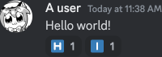

# Discord letter reaction bot

I like reacting to people's nonsense using letter emojis. This bot makes that
easier:

## Usage

1. someone posts something stupid

   

2. issue a `/lr` command to the bot

   

3. enjoy

   

## Things to know

- `/lr` will always and only react on the last user message.
- `/lr` is case insensitive: `/lr hi` and `/lr HI` will both make the reactions
  above.
- Only letters are supported, no digits.
- Duplicate letters are not supported. Eventhough some letters have multiple
  emojis such as 🇦 and 🅰️, message with duplicate letters are not accurately
  transformed in reactions. Issuing `/lr aa` will not react `🇦🅰️`, only `🇦`.
- Issuing `/lr !` will delete all reactions.

## Start the bot

1. Install [`concord`](https://github.com/Cogmasters/concord)
   ```sh
   git clone https://github.com/cogmasters/concord.git
   cd concord
   make
   sudo make install
   cd ..
   ```
2. Clone and compile this repository
   ```sh
   git clone https://github.com/altaris/dlrb
   cd dlrb
   make
   ```
3. Copy `config.json.template` and set the bot's token.
4. Invoke
   ```sh
   ./dlrb config.json
   ```
